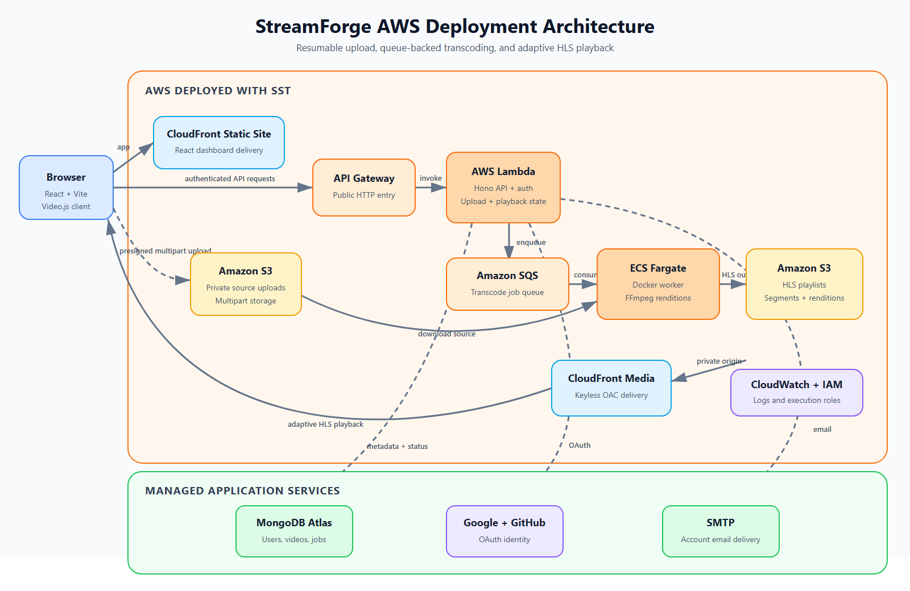

# StreamForge

StreamForge is a full-stack video streaming platform for resumable uploads, asynchronous transcoding, and adaptive HLS playback. It combines a React dashboard with a Hono API, multipart Amazon S3 uploads, queue-backed FFmpeg workers on Amazon ECS, and CloudFront delivery from a private media bucket.

## AWS Deployment Architecture



The client is delivered through the AWS static-site/CDN layer. API requests pass through Amazon API Gateway to the Hono application running on AWS Lambda. Large video files upload directly from the browser to private Amazon S3 storage through presigned multipart requests. The API records video and job state in MongoDB Atlas and sends completed uploads to Amazon SQS. A Dockerized FFmpeg worker on Amazon ECS Fargate consumes those jobs, creates adaptive HLS renditions, and writes the playlists and segments back to S3. A separate CloudFront media distribution reads the private bucket through Origin Access Control and delivers the resulting stream to Video.js.

## Features

### Authentication and accounts

- Email and password signup and signin
- JWT-based authenticated sessions
- Email verification using one-time passwords
- Forgot-password and reset-password flows
- Google and GitHub OAuth signin
- Secure logout and current-user session checks

### Video upload and recovery

- Direct multipart video uploads to Amazon S3
- Presigned upload URLs generated by the API
- Client-side file and part fingerprints
- Resumable uploads with persisted part reconciliation
- Upload progress reporting
- Existing-upload detection to avoid duplicate transfers

### Transcoding and processing

- Asynchronous transcode jobs delivered through Amazon SQS
- Dockerized worker deployed as an Amazon ECS Fargate service
- FFmpeg-generated HLS master and rendition playlists
- Adaptive 360p, 480p, 720p, and 1080p outputs when supported by the source
- Processing-state and failure tracking in MongoDB
- Long-running queue visibility and retry handling

### HLS playback

- Video.js player with adaptive HLS playback
- Automatic quality selection by default
- Manual resolution selection
- Configurable playback speed
- Fullscreen-compatible player controls
- Private S3 origin protected through CloudFront Origin Access Control
- CloudFront caching and byte-range support for media delivery

### Messaging and reliability

- Transactional account email delivery through SMTP
- Centralized API error handling and CORS configuration
- Internal authentication between application services
- IAM-scoped access to S3 and SQS resources
- CloudWatch-compatible Lambda and ECS logging

### Dashboard experience

- Responsive React dashboard built with TypeScript
- Centered upload workflow with live progress
- Video library with processing and readiness states
- Reusable interface components with Tailwind CSS and Radix UI
- Server-state caching and synchronization with TanStack Query
- Animated interactions using Framer Motion

## Technology Stack

| Layer          | Technologies                                                                                         |
| -------------- | ---------------------------------------------------------------------------------------------------- |
| Frontend       | React 19, TypeScript, Vite, Tailwind CSS, TanStack Query, Radix UI, Framer Motion                    |
| Video playback | Video.js, HLS, adaptive quality selection                                                            |
| API            | Hono, Node.js, TypeScript, Zod                                                                       |
| Data           | MongoDB Atlas, Mongoose                                                                              |
| Storage        | Amazon S3, presigned URLs, multipart uploads                                                         |
| Transcoding    | FFmpeg, Docker, Amazon ECS Fargate                                                                   |
| Messaging      | Amazon SQS                                                                                           |
| AWS deployment | SST, CloudFront, Origin Access Control, API Gateway, Lambda, S3, SQS, ECS, ECR, VPC, IAM, CloudWatch |
| Tooling        | pnpm workspaces, Turborepo, TypeScript                                                               |

## Repository Structure

```text
apps/
  api/                     Hono API, video controllers, routes, models, and services
  transcoder/              Dockerized SQS worker and FFmpeg HLS pipeline
  ui/                      React dashboard and Video.js player
packages/
  clients/                 Shared S3, SQS, and transcoder clients
  database/                Shared MongoDB connection
  env/                     Shared client and server environment validation
  httpUtils/               Shared HTTP response and error helpers
  media-models/            Shared video and transcode-job definitions
  utils/                   Shared authentication and validation utilities
services/
  auth/                    Authentication, OAuth, verification, and user services
  email/                   Email templates and SMTP delivery
scripts/
  sst.mjs                  Docker image build, ECR push, and SST deployment wrapper
sst.config.ts              AWS infrastructure definition
```

## Local Development

Install dependencies and start the workspace:

```bash
pnpm install
pnpm dev
```

The workspace reads local application configuration from `.env.development.local`. Configure MongoDB, S3, SQS, OAuth, SMTP, JWT, and the IAM credentials used by the local AWS SDK there.

Both `.env.development.local` and `.env.production.local` are Git-ignored. Never commit or share their real values. The AWS configuration follows this shape:

```dotenv
AWS_REGION=eu-north-1
AWS_ACCESS_KEY_ID=replace_with_your_iam_access_key_id
AWS_SECRET_ACCESS_KEY=replace_with_your_iam_secret_access_key
# AWS_SESSION_TOKEN=replace_with_your_session_token_if_using_temporary_credentials
```

The StreamForge scripts load the appropriate environment file automatically. To verify the development credentials with the AWS CLI first, load its values into the current PowerShell process:

```powershell
Get-Content .env.development.local |
  Where-Object { $_ -match '^[^#][^=]*=' } |
  ForEach-Object {
    $name, $value = $_ -split '=', 2
    Set-Item -Path "Env:$name" -Value $value
  }

aws sts get-caller-identity
pnpm dev
```

## AWS Deployment

The production deployment script loads `.env.production.local`, builds the transcoder image for Linux with Docker Buildx, pushes the image to Amazon ECR, and then deploys the SST application. Docker must be running before starting the deployment.

To authenticate SST through the standard AWS credential-provider chain without putting credentials on the command line, configure a dedicated local AWS profile:

```powershell
aws configure --profile streamforge-deploy
aws sts get-caller-identity --profile streamforge-deploy
$env:AWS_PROFILE = 'streamforge-deploy'
pnpm deploy:prod
```

SST provisions the frontend static site, API Gateway, Lambda API, CloudFront media router, private S3 access policy, SQS transcode queue integration, ECS Fargate transcoder service, VPC, DNS records, runtime configuration, and associated IAM permissions.
